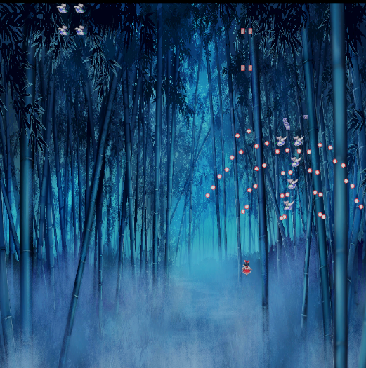
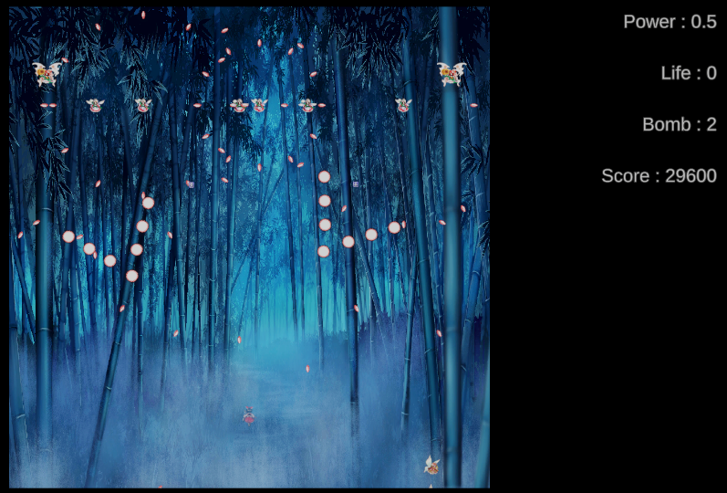
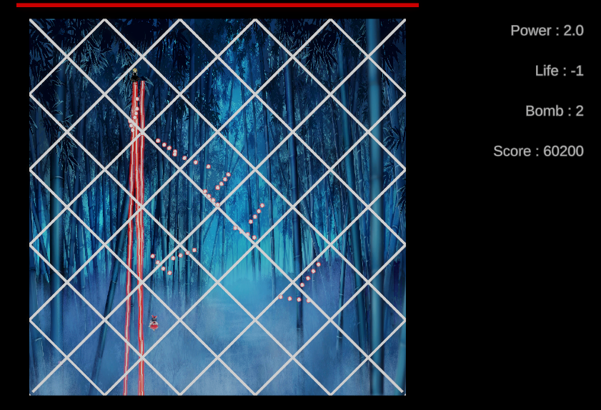

# Touhou 🔫

## 🎮 프로젝트 소개
**Touhou**는 동방 프로젝트 스타일의 탄막 슈팅 게임입니다.  
다양한 탄막 패턴, 보스 페이즈, 모션별 탄 개별 이동, UI 연동 등 슈팅 게임의 핵심 요소를 직접 설계하고 구현한 Unity 개인 프로젝트입니다.

- **개발 엔진**: Unity 6000.1.1f1
- **장르**: 탄막 슈팅 / Bullet Hell
- **개발 기간**: 약 1개월
- **스크립트 GitHub**: [https://github.com/biueapple/Touhou](https://github.com/biueapple/Touhou)

---

## 🛠 주요 기술 및 시스템

### 🎯 탄막 패턴 시스템
- 패턴별 ScriptableObject 및 Phase 설계로 유연한 보스 패턴 구성
- Spiral, Triangle Spread, Random Shower 등 다양한 탄막 구현
- Coroutine 기반 타이밍 컨트롤 (PatternScheduler 준비 중)

### 🔄 탄 모션 구조
- 각 탄에 Sin, Zigzag, Bounce, Accelerate 등 다양한 이동 모션 부여
- 방향 벡터를 기준으로 `Vector3.Cross` 활용한 수직 흔들림 처리

### 🧠 보스 페이즈 시스템
- Phase 단위로 패턴 전환 가능
- 이후 체력 기반 전환, 시간 기반 순환, 랜덤 반복 가능성 고려 중

### 🎮 플레이어 컨트롤
- 이동/사격 입력 구현
- 목숨/파워 UI 연동 및 텍스트 실시간 갱신
- 충돌 판정 및 무적 시간
- 리플레이 구현

### 📊 UI 시스템
- 목숨, 파워, 점수 텍스트 UI 구현

---

## 🎯 구현 의도 및 성과
- 동방 스타일 슈팅 게임의 핵심 구조를 직접 설계하고 확장 가능한 패턴 시스템 구성
- 탄막 개별 모션 처리와 구조 분리 연습
- UI 및 Phase 설계 경험을 통해 게임 흐름을 전체적으로 조율하는 능력 향상

---

## 📸 스크린샷 / 영상
> (아래 이미지 파일을 `Screenshots` 폴더에 넣고 연결해 주세요)

### 기본 탄막

### 삼각 탄막

### 나선 탄막

### UI (파워, 목숨)

---

## 📂 실행 방법
1. Unity 6000.1.1f1 이상 버전에서 열기  
2. `SampleScene` 실행  
3. 키보드: 방향키 이동 / Z키 사격

---

## 🙋‍♂️ 담당 역할
- 전체 시스템 설계 및 프로그래밍
- 탄막 패턴, 보스, UI, 입력 등 게임 전반 담당
- 플레이어, 보스, 패턴 등 객체 간 구조 및 확장 고려

---

## 🔗 관련 링크
- GitHub: [https://github.com/biueapple/Touhou](https://github.com/biueapple/Touhou)
